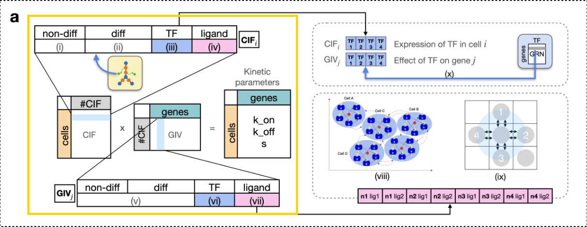
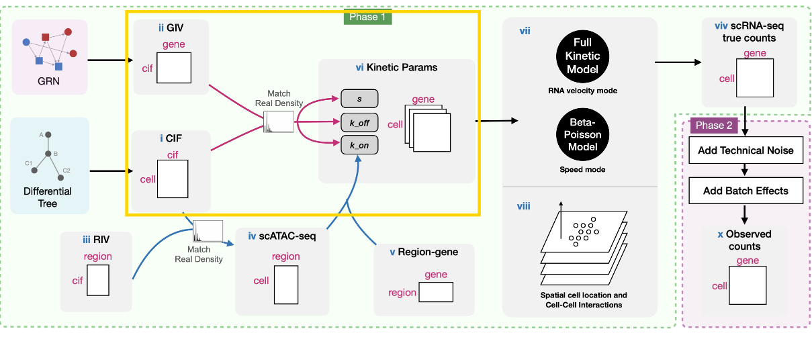
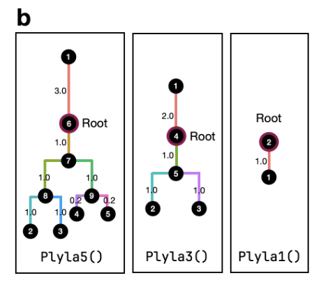
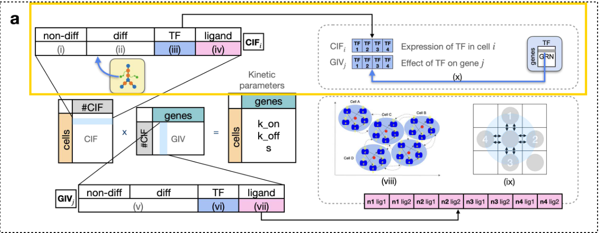
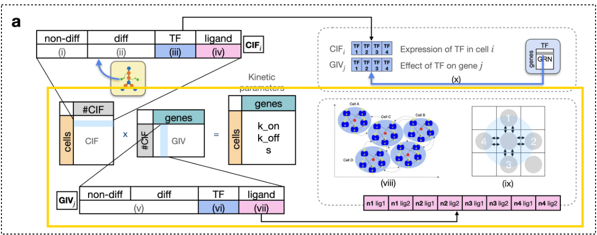
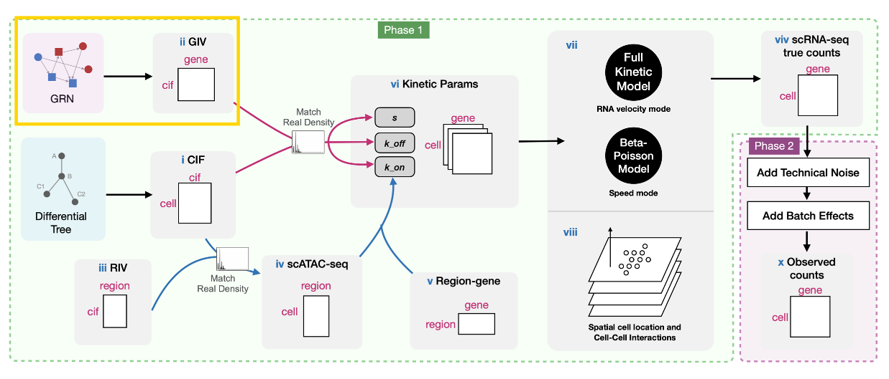
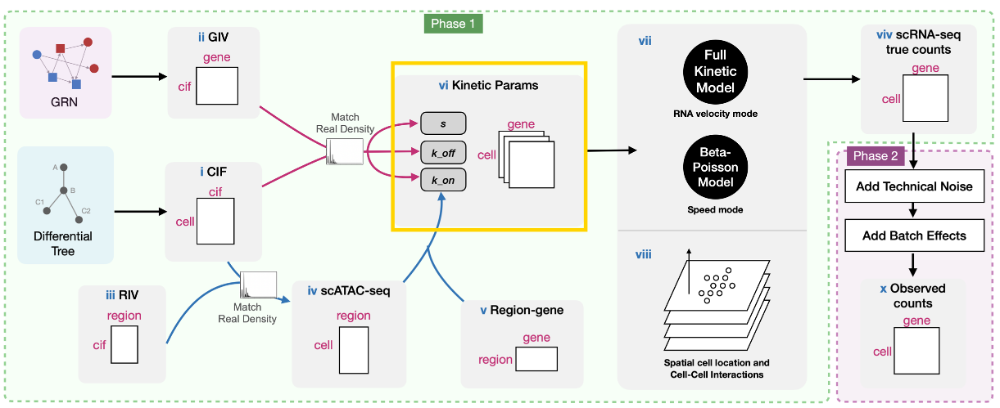
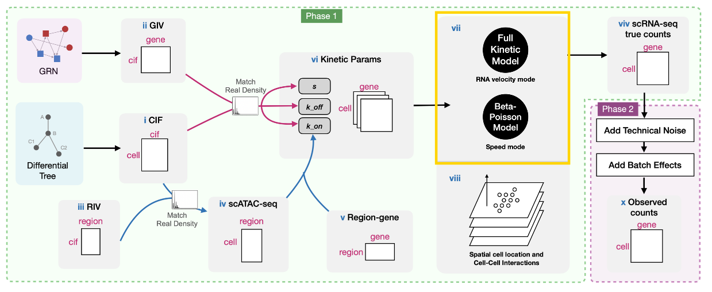
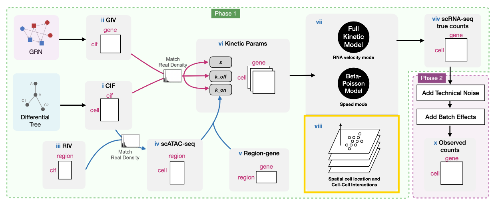
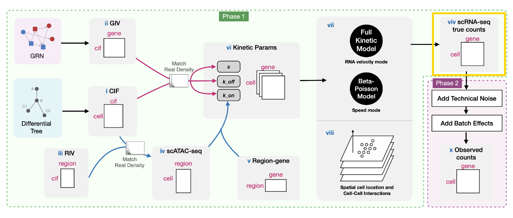

## Idea

## 问题
既然是用来sim实验数据的，前提是本身必须符合很多的归纳偏置
但是这些偏置情况，是否用统计学就够了？
而且能用deep learning的地方并不多

论文的初衷可能是为了降低实验成本，不需要做实验即可用AI模拟数据
但是论文里并没有回答以下问题——

其一是数据的真实性，究竟有没有用？能不能用？
是否还是必须做一组湿实验来验证更有效？

其二是用denovo模拟器的情况下，
是否仅仅只是为了模拟一下大致规律？
这种情况下提高某几个细胞的预测效果可能意义不大

如果要用AI来做——

其三是用AI来模拟，精度如何？
是否像某些领域一样，AI的提升效果并不如传统方法，反而费算力

其四是数据的问题
如果用合成数据来训练，模型本身的能力如何
用真实数据来微调，细胞本身就存在千变万化的分化情况，很难有数据能够涵盖如此之多的情况

其五是模型体量的问题
是否只有达到emerge，我们的AI模拟器才有意义
达到这样的能力需要多少体量的真实数据？需要多大的参数

### CIF和GIV
原文：CIF和GIV，原文为由四部分拼接而成的向量
思路：映射为embedding，把CIF看成细胞层面->句子，GIV看成基因层面->token，设计一个特殊token映射细胞整体层面的表达，用于模拟CCI
问题：如何映射embedding？如果原文的表示包含了四种信息，映射后也要经过四重处理，但是这样训练起来可能会比较难

### RIV
原文：用于表示染色质区域的可及性状态，由高斯分布得到
思路：映射为embedding,和CIF相乘或者计算cross attention
为什么：保持和原文一致，RIV是和CIF进行交互的，因此也应该和CIF保持在一个维度上

### GRN
原文：由用户提供，符合某个分布，且GRN=RIV $\times$ $R_{peak}$
思路：

### diff tree
原文：用分化树表示细胞的分化情况，且可以用参数控制
问题：现实中的细胞的确具有统计规律，但是分化的情况，原文用diff-CIF直接嵌入到CIF和GIV中
思路：分化情况->encoder->输出一个向量，再用decoder来decode分化后的embedding，而是否分化则要符合统计学规律

### kinetic parameters
原文：k_on, k_off, s是由CIF $\times$ GIV后再与CIF$\times$RIV相乘后得到
问题：原文没有解释k_on这么做有什么意义，且我也没有发现它的意义
思路：MLP来代替

### CCI
思路：将整个细胞场建模为二维图像，细胞位置为像素级别，每个细胞有一个特殊token用于和其他细胞进行交互

原文： t步，每一步增加一个细胞，且CCI具有累积效应
不足：原文的CCI仅考虑四个邻居，且配体之间的相互作用也考虑的十分有限
思路：CCI由Attention来模拟，没有配体和细胞数量的限制

原文：每次新加的细胞布局，有三种情况，细胞有概率成为邻居
不足：在一定区域内的细胞实际上都有可能成为邻居，且存在即使离得很近也可能没有相互作用的情况
思考：像文本一样，即使两个字符相近也可能没有作用，即使离得很远也可能有相互作用
思路：仍然用Attention，在输入Embedding后设计位置编码
思路plus：细胞的分布是二维结构，并不是文本的一维结构，可能要类似ViT设计patch positional encoding，且要存在某些patch是空的情况

思考plus：已经有的所有细胞会形成一个生物效应场，势必会影响下一个细胞的分化情况
思路：设计一个特殊token在序列末尾，用来模拟场的效应，新细胞token输入时加上这个token值，再预测加入后的场效应token

原文：预制了一个CCI数据库
思路：把数据库里的内容学到神经网络中

### RNA velocity
保留

### Add Noise
保留

## Method

### CIF 和 GIV

CIF(Cell Identity Factors):编码与细胞身份相关的生物学信息，例如细胞群体、GRN、CCI

GIV(Gene Identity Vectors):编码与基因相关的生物学信息，包括基因的调控模式和功能特性

CIF和GIV的一维向量由以下四个部分组成：
- non-diff-CIF:从标准差为$\sigma_{\text{cif}}$的高斯分布中采样，模拟固有的细胞异质性

- diff-CIF:由Differential Tree生成diff-CIF，控制用户期望的细胞群体分化情况

- tf-CIF:GRN的编码，模拟了转录因子如何影响细胞中基因的表达，长度等于转录因子的数量

- lig-CIF:如果启用CCI模拟，则编码CCI，对应来自临近细胞的影响

CIF: $n_{\text{cell}} \times n_{\text{cif}}$

GIV: $n_{\text{cif}} \times n_{\text{giv}}$

$(k_{\text{on}}, k_{\text{off}}, s) = CIF \times GIV$

动力学模型参数：
- s:当基因处于开启状态，mRNA以s速率合成
- k_on:基因从关闭到开启的速率
- k_off:基因从开启到关闭的速率
- d:当基因处于开启状态时，mRNA以d速率降解（通常将d固定为1，并使用相对值来表示其他三个参数）

### diff-CIF 

diff-CIF的生成方式如下：从树的根节点开始，沿着树进行高斯随机游走，为每个细胞生成维度为 $n_{\text{diff-CIF}}$ 的差异CIF向量。
- 参数 $\sigma_{\text{cif}}$ 控制随机游走的标准差，因此较大的 $\sigma_{\text{cif}}$ 会产生更松散和更嘈杂的轨迹结构,较小的 $\sigma_{\text{cif}}$ 会产生更清晰的聚类边界。
- 参数 $r_d$ 用于控制差异CIF与非差异CIF的相对数量。较大的 $r_d$ 会使输出中的轨迹更加清晰和明确；较小的 $r_d$ 会使轨迹变得模糊。

对于每个维度，所有细胞的差异CIF值 $v_i$ 为

 $$ v_i = \sum_{t=1}^{i} q_t \quad \text{where} \quad q_t = N(0, \sigma_t) $$ 

 $\sigma_t$ 是沿着树游走的距离，即细胞 $t$ 与 $t - 1$ 之间的距离。

### tf-CIF 

细胞沿着给定的细胞分化树逐个生成，其中第 $t$ 个细胞中转录因子（TFs）的表达影响第 $t+1$ 个细胞的基因表达。具体来说，第 $t+1$ 个细胞的 tf-CIF 的第 $i$ 个位置的计算公式为：

 $$ \text{tf-CIF}^{(t+1)}_i = \frac{x^{(t)}_i }{  x^{(t)}_i + \frac{1}{n} \sum_{l}x^{(t)}_l  }$$ 

其中， $x(t)_i$ 是第 $t$ 个细胞中第 $i$ 个转录因子的表达水平。根细胞的相应tf-CIF是从用户提供的高斯分布 $N_{\text{cif}}$ 中随机采样的。

基因的GIV中的转录因子部分长度为 $n_{\text{TF}}$ 。考虑所有基因，我们得到一个 $n_{\text{gene}} \times n_{\text{TF}}$ 的矩阵，称之为GRN效应矩阵。这个矩阵编码了用户提供的真实GRN。
- 在计算 $s$ 参数时，GRN效应矩阵被包含在GIV中，其中 $(i, j)$ 位置的值表示转录因子 $j$ 对基因 $i$ 的调控强度。
- 对于 $k_{\text{on}}$ 和 $k_{\text{off}}$ ，tf-CIF向量是使用 $N_{\text{cif}}$ 采样的(假设GRN不影响基因的激活状态)

### lig-CIF

CCI(Cell-Cell Interactions):细胞间相互作用

使用一个二维的 $k \times k$ 网格容纳 $n$ 个细胞（可以由用户指定；如果未提供，则默认使用细胞数量的250%）。一个细胞最多可以有 $n_{nbs}$ 个具有CCI效应的邻居（图2a中蓝色圆圈的范围内，这个范围可以调整），$n_{\text{lig}}$ 个配体，lig-CIF 长度为 $n_{\text{lig}} \cdot n_{nbs}$ 

lig-GIV向量包含CCI强度值，例如，图2a中的“n2 lg3”条目表示来自位置2的邻居的配体3与中心细胞的受体2之间的CCI强度。在模拟过程中，每个细胞的配体CIF将从其前一个细胞继承，配体CIF向量的每个条目对应于一个邻居的配体。

- 对于 $k_{\text{on}}$ 和 $k_{\text{off}}$ ，使用相同的高斯分布 $N_{\text{cif}}$ 
- 对于 $s$ ，由于配体-受体对与转录因子-靶基因对的相似性，采用与tf-CIF类似的策略：细胞 $i$ 的配体CIF是细胞 $i \neq 1$ 的配体基因表达计数的归一化向量

为了生成真实的CCI，scMultiSim预定义了一个配体-受体数据库，由用户输入的 $m \times 3$ 矩阵 $S$ 表示。总共有 $m$ 个配体-靶标对，分别对应于 $S$ 的每一行。对于每一对 $i$ ，有三个参数：配体基因 $L_i$ 、受体基因 $T_i$ 和效应 $E_i$ ，表示配体对受体表达的影响强度。对于每一对细胞类型，这两种细胞类型之间的真实CCI是从配体-受体数据库中采样得到的（对应于 $S$ 的列）。对于每一对邻近细胞，它们之间的真实CCI遵循细胞类型水平的真实CCI：如果这两个细胞分别属于两种细胞类型 $C1$ 和 $C2$ （其中 $C1$ 可以与 $C2$ 相同），那么这两个细胞之间的CCI遵循 $S$ 中定义的对应于配对 $(C1, C2)$ 的CCI。用户可以通过让每对细胞使用从细胞类型水平真实CCI中采样的配体-受体对的一个子集，来对每对细胞进行更细致的控制。

### Generating GIV

基因的GIV向量与CIF向量的长度相同。基因的GIV中的值作为CIF中相应因素的权重，即相应的CIF对基因的影响程度。如果我们有 $n_{\text{gene}}$ 个基因，我们得到一个大小为 $n_{\text{cif}} \times n_{\text{gene}}$ 的GIV矩阵。

对于 $k_{\text{on}}$ 和 $k_{\text{off}}$ :
- 非差异CIF（non-diff-CIF）和差异CIF（diff-CIF）是从分布 $G$ 中采样的，如下所示：

 $$
Y \sim
\begin{cases}
N_{\text{giv}}, & \text{with probability } 1 - p_G \\
0, & \text{with probability } p_G
\end{cases}
\quad (6)
$$ 

其中， $p_G$ 是一个指定为零的概率参数，而 $N_{\text{giv}}$ 是一个用户可调整的高斯分布。

- 由于转录因子（TF）/配体仅影响 $s$ ，因此tf-GIV和lig-GIV均为零。

对于$s$:
- tf-GIV子矩阵是基因调控网络（GRN）效应矩阵，即一个 $n_{\text{TF}} \times n_{\text{gene}}$ 矩阵，其中 $(i, j)$ 位置的条目表示转录因子 $i$ 和基因 $j$ 之间的调控效应。

- lig-GIV子矩阵是CCI矩阵。nd-GIV子矩阵是从 $G$ 中采样的。

为了在diff-GIV中纳入转录因子和被调控基因之间的联系：

1. 对于每个转录因子基因，随机选择2个GIV条目，并赋予它们一个固定的较小数值。
2. 对于每个靶基因，它应该使用与其调控因子相同的GIV向量。如果一个基因有多个调控因子，其基因效应将是调控因子效应的组合。这是通过将 $n_{\text{diff}} \times n_{\text{TF}}$  GIV矩阵与 $n_{\text{TF}} \times n_{\text{gene}}$ 效应矩阵相乘来实现的。如果一个基因既是转录因子又是靶基因，其GIV将是 $0.5 \cdot ((y) + (x))$ 。

### scATAC

RIV矩阵是从一个类似于G的分布R中采样的：

 $$
Y \sim
\begin{cases}
N_{\text{riv}}, & \text{with probability } 1 - p_{0}^R \\
0, & \text{with probability } p_{0}^R
\end{cases}
\quad 
$$ 

其中， $p_{0}^R$ 是为零的概率，而 $N_{\text{riv}}$ 是一个用户可调节的高斯分布。有了CIF和RIV矩阵，可以通过以下步骤生成 $n_{\text{cell}} \times n_{\text{region}}$ 的scATAC-seq数据：
(1) 将CIF矩阵与RIV矩阵相乘；
(2) 将矩阵缩放以匹配真实数据分布；
(3) 向scATAC-seq数据添加内在噪声（从较小的高斯分布中采样）。

为了将scATAC-seq数据与scRNA-seq数据之间的关系纳入考量，我们使用scATAC-seq数据来调整用于生成scRNA-seq数据的 $k_{\text{on}}$ 参数，考虑到染色质可及性会影响基因的激活状态。给定表示转录因子-基因调控（GRN）的矩阵 $M_{\text{tg}}$ 、转录因子基序到区域矩阵 $M_{\text{tr}}$ 以及峰到基因矩阵 $M_{\text{rg}}$ ，我们认为以下关系成立：

 $$
M_{\text{tg}} = M_{\text{tr}} \cdot M_{\text{rg}} 
$$ 

因此，如果用户直接输入 $M_{\text{tr}}$ 和 $M_{\text{rg}}$ ，scMultiSim将根据公式生成GRN。然而，如果用户输入GRN（ $M_{\text{tg}}$ ），scMultiSim可以自动生成其他两个矩阵。首先，生成区域到基因的 $M_{\text{rg}}$ 矩阵，以表示染色质区域和基因之间的映射关系，其中每个基因可以由1到3个连续区域调控。用户可以输入一个区域分布向量 $r$ ，例如， $r = (0.1, 0.5, 0.4)$ 表示一个基因可以由三个区域调控，其被一个、两个和三个连续区域调控的概率分别为0.1、0.5和0.4。然后，通过设置 $M_{\text{tr}}(i, j) = 1$ （如果转录因子 $j$ 调控与区域 $i$ 对应的任何基因）来构建二进制的基序到区域矩阵。

### kinetic parameters

我们首先将CIF和GIV相乘的结果分别记为 $M1$ 、 $M2$ 和 $M3$ ，分别对应于 $k_{\text{on}}$ 、 $k_{\text{off}}$ 和 $s$ 。

- **$k_{\text{on}}$**：首先准备一个 $n_{\text{region}} \times n_{\text{gene}}$ 的0-1区域到基因矩阵 $Z$ ，其中 $Z_{ij}$ 表示区域 $i$ 与基因 $j$ 相关联（ $Z$ 作为区域到基因矩阵输出）。我们将scATAC-seq矩阵与 $Z$ 相乘，得到 $n_{\text{cell}} \times n_{\text{gene}}$ 的参数矩阵 $M\tilde{1}$ 。由于scATAC-seq数据是稀疏的， $M\tilde{1}$ 中有许多零。因此将 $M\tilde{1}$ 中的零条目替换为 $M1$ 中对应的条目（缩放到小于 $M\tilde{1}$ 中最小非零条目的值），以帮助区分零条目。最后， $M\tilde{1}$ 被采样以匹配从真实数据推断出的 $k_{\text{on}}$ 的分布。

- **$k_{\text{off}}$**：通过将 $M2$ 缩放以匹配真实数据分布来获得参数。对于 $k_{\text{on}}$ 和 $k_{\text{off}}$ ，可以通过可选的双峰因子 $B$ 调整基因表达的双峰性。较大的 $B$ 将同时缩小 $k_{\text{on}}$ 和 $k_{\text{off}}$ ，从而增加双峰性。

- **$s$**：通过将 $M3$ 缩放以匹配从真实数据推断出的 $s$ 的分布来获得参数。然后，用户可以使用“scale.s”参数线性缩放 $s$ 。这允许调整细胞的大小——某些数据集可能倾向于较大的细胞，而某些数据集可能倾向于较小的细胞

### The Beta-Poisson model and intrinsic noise

$x$: gene expression level (which is also mRNA count)

$$y = Beta(k_{\text{on}}, k_{\text{off}})$$
$$x = Poisson(y * s)$$

$\sigma_i$: intrinsic noise

$$ x_{\sigma_i} = \sigma_i \cdot x + (1 - \sigma_i) \cdot \left( \frac{k_{\text{on}}}{k_{\text{on}} + k_{\text{off}}} \cdot s \right) \quad (3) $$ 

两种模式
- Full Kinetic Model，其中基因在一段时间内会经历多次开启/关闭状态的变化，并生成剪接/未剪接RNA计数。（需要生成未剪接mRNA计数和RNA 速度）
- Beta-Poisson Model，它等同于动力学模型的主方程，比完整动力学模型运行速度更快。(只需要生成剪接mRNA计数)

### Generating spatial data

在每一步 $t$ 中，一个新的细胞被认为诞生并被添加到网格中。当添加一个新的细胞时，它有 $p_n$ （细胞类型亲和力）的概率成为与之相同细胞类型的现有细胞的邻居。
此外，在最后的时间步之后，用户可以选择继续模拟 $t_c$ 步，同时保持所有细胞的位置不变（默认为10步）。

放置新细胞的策略：
- 所有细胞随机放置；
- 只有前 $m$ 个细胞随机放置，其余的遵循 $p_n$ 

多种细胞空间布局选项：
- “layers”，细胞类型在组织中形成层，如大脑皮层；将新细胞放置在现有细胞旁边，但首先根据细胞类型对所有细胞进行排序以生成层状结构。最后，一小部分细胞的位置被随机化以增加一些噪声。
- “islands”，像被其他细胞类型包围的肿瘤；用户可以指定哪些细胞类型应该形成岛屿。首先通过随机将新细胞放置在现有细胞旁边来生成岛屿形状，然后将岛屿放置在网格中，并确保它们不重叠。接下来，非岛屿细胞类型会以类似的亲和力参数 $p_n$ 随机放置在网格中。
- “default”，通过调整 $p_n$ 参数可以产生多种布局变化。

需要输入一个预定义的细胞分化树来定义细胞中的分化拓扑结构。一个新细胞总是在分化树的根部处于初始状态。在每一步中，一个现有细胞沿着细胞分化树中的随机路径向前移动，代表细胞的发育。最后一步中的基因表达被输出为观测数据。在最后一步中，细胞将处于不同的发育阶段，即位于树的不同位置。因此，最终输出将包含由树定义的轨迹。

尽管是以最后时间点的所有细胞作为输出（这与实际数据的情况相同），但由于细胞在不同的时间步被添加，因此具有不同的发育阶段，保证了不同细胞类型的呈现。
此外，同一个细胞（在相同位置）在不同的时间步中具有相同的diff-CIF，因此diff-CIF中编码的轨迹在最后一步中得以保留。细胞的转录因子（TF）和配体CIF在当前步骤中是从前一个步骤继承而来的，以确保其他因素保持不变。

计算邻近细胞表达之间的相关性
- 选择一个特定的配体-受体对 $(l, r)$ 。设 $T(a, b) = \{\text{true}, \text{false}\}$ 表示细胞 $a$ 和细胞 $b$ 之间对于 $(l, r)$ 存在CCI。
- 对于每个细胞 $i$ ，得到它的邻居 $n_i$ 包含4个细胞的向量，随机采样一个包含4个非相邻细胞的向量 $m_i$ 。设 $x_{cg}$ 表示细胞 $c$ 和基因 $g$ 的表达。
- 使用对 $\{(x_{li}, x_{jr})|j \in n_i, T(i, j) = \text{true}\}$ 计算“具有CCI的邻近细胞”相关性，
- 使用对 $\{(x_{li}, x_{jr})|j \in n_i, T(i, j) = \text{false}\}$ 计算“没有CCI的邻近细胞”相关性，
- 使用对 $\{(x_{li}, x_{jr})|j \in m_i\}$ 计算“非邻近细胞”相关性。
- 在计算相关性时忽略相同类型的细胞对，因为它们倾向于具有相似的表达。

用户可以选择启用输出单细胞水平CCI真实数据。启用时，通过从细胞类型水平真实数据中采样80%的相互作用边界，预先确定相互作用的邻近细胞对。

### RNA velocity

当使用完整动力学模型时，scMultiSim可以根据动力学参数为每个细胞生成剪接和未剪接的计数。细胞的初始剪接计数 $x_s$ 和未剪接计数 $x_u$ 是其在分化树上前一个细胞的计数。对于第一个细胞，剪接/未剪接计数为：

 $$
x_s = \frac{s \cdot k_{\text{on}} \cdot \beta}{k_{\text{on}} + k_{\text{off}}}
$$ 

 $$
x_u = \frac{s \cdot k_{\text{on}} \cdot d}{k_{\text{on}} + k_{\text{off}}} 
$$ 

其中， $\beta$ 和 $d$ 分别表示基因的剪接率和降解率。这两个参数都是从用户控制的正态分布中采样的。

将细胞周期长度设置为 $L = \frac{1}{k_{\text{on}}} + \frac{1}{k_{\text{off}}}$ ，并将其划分为多个步骤。步骤数遵循：

 $$
m = \left\lceil \frac{L}{\min\left(\frac{1}{k_{\text{on}}}, \frac{1}{k_{\text{off}}}\right)} \right\rceil
$$ 

还提供了一个可选的细胞周期长度因子 $\eta_L$ 参数来调整周期长度。然后，基于 $p_{\text{on}} = \frac{m \cdot k_{\text{on}}}{L}$ 和 $p_{\text{off}} = \frac{k_{\text{off}}}{m \cdot L}$ 计算基因开启或关闭的概率。在每个模拟步骤中，根据 $p_{\text{on}}$ 和 $p_{\text{off}}$ 更新细胞的当前开启/关闭状态，并生成剪接/未剪接计数 $x_s$ 和 $x_u$ 。

步骤 $t$ 的剪接计数通过以下公式获得：

$$
x^t_s = x^{t-1}_s + \frac{L}{m} (\beta \cdot x^{t-1}_u - d \cdot x^{t-1}_s) 
$$ 

未剪接计数通过以下公式获得：

$$
x_t^u =
\begin{cases}
x^{t-1}_u + \frac{L}{m} (s - \beta \cdot x^{t-1}_u), & \text{on} \\
x^{t-1}_u - \frac{L}{m} (\beta \cdot x^{t-1}_u), & \text{off}
\end{cases}
$$ 

输出的 $x_s$ 和 $x_u$ 是最终步骤 $t = m$ 的值。真实的RNA速度计算如下：

 $$
v = \beta \cdot x_u - d \cdot x_s 
$$ 

在对计算方法进行基准测试时，通过对原始速度数据应用高斯核KNN来获得KNN平均RNA速度，其中 $k = \left\lceil \frac{n_{\text{cell}}}{50} \right\rceil$ 。然后计算每个细胞的归一化因子 $s_i = |v_i|$ 来归一化速度，其中 $v_i$ 是细胞 $i$ 的速度向量。

### Add Noise

技术噪声被添加到真实的mRNA计数中以生成观测计数（观测到的单细胞RNA测序数据）。该工作流程遵循SymSim的方法：模拟多轮mRNA捕获和PCR扩增，然后进行基于UMI或非UMI协议的测序和分析。参数 $\alpha$ 控制捕获效率，即在捕获步骤中转录本的亚采样率，这可以在不同细胞中变化，用户可以使用正态分布 $\alpha \sim N(\alpha_{\mu}, \alpha_{\sigma})$ 来指定它。测序深度 $d \sim N(d_{\mu}, d_{\sigma})$ 是另一个控制观测数据质量的参数。

通过首先将细胞划分为不同的批次，然后基于偏移因子添加特定于基因和批次的高斯噪声来添加批次效应。对于批次 $i$ 中的每个基因 $j$ ，偏移因子是从均匀分布 $\text{Unif}(\mu_j - e_b, \mu_j + e_b)$ 中采样的，其中 $\mu_j \sim N(0, 1)$ ，而 $e_b$ 是控制批次效应强度的参数。